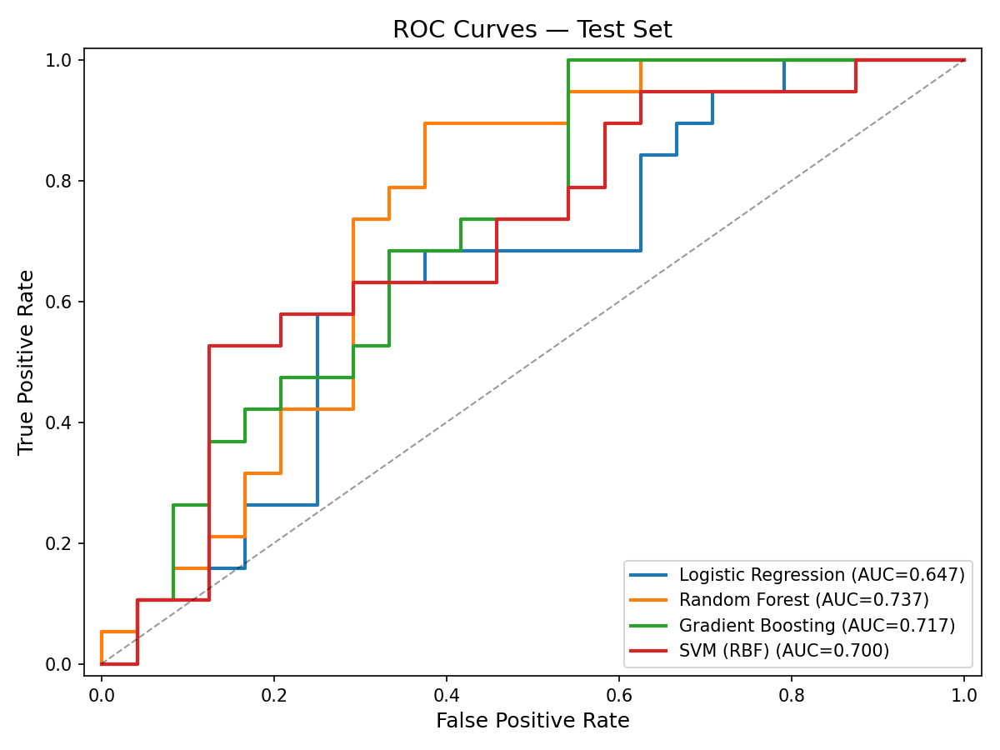

# Methods Document — THA Cement Decision ML Study

**Working title:** The Artificial Intelligence versus the Orthopaedic Surgeon in Decision-Making of Cemented or Uncemented Total Hip Arthroplasty

**Last updated:** 2026-08-24

---

## 1. Study Design

Retrospective cohort study using preoperative CT scans from patients who underwent total hip arthroplasty (THA) at Landspítali University Hospital. The study develops supervised machine learning models to classify implant fixation (cemented vs. non-cemented) from CT-derived imaging features, demographic variables, and their combination, evaluated across multiple ground-truth definitions (Section 3) to characterize both the predictive value of quantitative imaging and its sensitivity to label uncertainty.

## 2. Data Sources

### 2.1 Cohorts

| Cohort | Scanner | Period | Patients | Notes |
|--------|---------|--------|----------|-------|
| Cohort_2 | Toshiba | 2023–2024 | ~50 | Newer acquisitions, generally high quality |
| Cohort_1 | Philips | ~2013 | ~100 | Older acquisitions, more variable quality |

Both cohorts followed similar preoperative CT protocols (bilateral hips, pelvis, and proximal femur acquired one day before THA). Cohort_1 data originates from prior studies conducted by the research team at the University of Reykjavík and Landspítali.

### 2.2 Variables

**CT-derived imaging features (model inputs):**
- Gruen zone BMD values: zones 1–7 (`zone_1_bmd` through `zone_7_bmd`)
- Cortical geometry: `cortical_area_mm2`, `cortical_thickness_mm`
- Radial measurements: `avg_outer_radius_mm`, `ray_inner_radius_mm`, `geometric_inner_R_mm`, `inner_radius_std_mm`

**Engineered features:**
- Zone average pairs: `zones_1_7_avg` (mean of zones 1 and 7), `zones_2_6_avg` (mean of zones 2 and 6)
- BMD-to-cortical ratios: zone averages divided by cortical thickness and cortical area
- BMD summary statistics: mean, standard deviation, and range across all 7 zones

**Demographic variables (recorded but excluded from modeling):**
- Age, sex, weight, height, BMI

**Surgeon classifications:**
- `Cement_vs_noCement_original`: original operating surgeon's decision
- `Halldor_decision`: independent classification by Dr. Halldór Jónsson Jr.
- `3d_surg`: classification by a third surgeon reviewer

### 2.3 Unit of Analysis

Each hip (left/right) constitutes one observation. Patients with bilateral scans contribute two observations, but all hips from the same patient are always kept in the same data split (train or test) to prevent data leakage.

## 3. Ground Truth Definition

Five ground truth strategies were defined to examine the impact of label uncertainty, all built from the same three surgeon classifications (`common_preprocessing.py`):

1. **Majority vote (`gt_majority`):** A hip is labeled "cemented" if at least 2 of the 3 raters (original surgeon, Halldór, third surgeon) classified it as cemented; otherwise "non-cemented." This is the **primary ground truth** used in the main analysis (scenarios 1, 3, 4).
2. **Original surgeon only (`gt_original`):** The operating surgeon's real-time decision alone serves as the label, independent of the other two raters (scenarios 6, 10, 11).
3. **Vote fraction (`gt_vote_fraction`, probabilistic):** The fraction of the 3 raters voting "cemented" (0, 0.33, 0.67, or 1.0) is used as a continuous regression target (scenarios 2, 12, 13).
4. **Halldór + 3D-surgeon agreement (`gt_h3d_agree`):** A hip is labeled only when the two independent reviewers (Halldór and the third surgeon) agree with each other; hips where they disagree are excluded. **This requires only 2 of 3 raters to agree and does not require the original surgeon's vote to match** — it is a 2-of-3 agreement subset, not full unanimity (scenario 5, kept for continuity with earlier reporting).
5. **Unanimous agreement (`gt_unanimous`):** A hip is labeled only when all 3 raters (including the original surgeon) agree with each other; hips with any disagreement are excluded. This is the correct "all surgeons agree" ground truth (scenarios 7, 8, 9).

Ground truths 4 and 5 are easy to confuse and are named deliberately to keep them distinct — `gt_h3d_agree` was originally intended to represent "unanimous agreement" in an earlier revision of this analysis, but on inspection only enforces 2-of-3 agreement; see `common_preprocessing.py`'s module docstring for the full history. Every ground truth other than the primary majority-vote label is treated as a sensitivity analysis (Section 9), each evaluated against all three feature sets (CT-only, demographics-only, CT+demographics) — see "Comparative sensitivity analyses" in the Discussion for the full 13-scenario matrix.

### 3.1 Inter-Rater Agreement

Before defining the ground truth, inter-surgeon agreement was quantified:
- **Pairwise percent agreement** for all three rater pairs
- **Fleiss' kappa** for the three-rater panel (binary classification)
- **Case-level categorization:** unanimous (3/3 agree), majority only (2/3 agree)

Label harmonization: "Uncemented" was mapped to "Non-cemented." Rows with the label "Already operated" were excluded from agreement analysis and modeling.

## 4. Data Quality & Exclusion Criteria

### 4.1 Scan Quality Flags

Scans annotated in the `notes` column as "Unusable with same HU range" were excluded. Scans flagged as "Questionable Quality" or "Questionable scan quality" were retained but their presence noted for sensitivity analysis.

### 4.2 Anomalous Value Detection

Rows were excluded if they contained CT feature values outside physiologically plausible ranges:
- Zone BMD values < 0.5 (artifact values, e.g. 0.14)
- Cortical area < 50 mm² (values such as 0.47, 3.96, 4.54 indicating failed segmentation)
- Cortical thickness < 2.0 mm (values such as 0.74, 1.24 indicating failed segmentation)

## 5. Preprocessing Pipeline

All preprocessing was performed in a leakage-safe manner: imputation and scaling parameters were fitted exclusively on the training set.

### 5.1 Train/Test Split

- **Split ratio:** 80% train / 20% test
- **Grouping:** Patient-level (`Anonymize_ID`) — all hips from a patient stay in the same split
- **Stratification:** Patient-level stratified split by target + cohort where feasible, with explicit fallback order: `target_plus_cohort` -> `target_only_fallback` -> `unstratified_fallback`
- **When reusing the “same split” in later analyses:** this refers to the same patient/hip membership in train and test (not just another 80/20 split). Matching was verified at the row key level (`Anonymize_ID` + `hip_side`).

The split mode actually used is recorded in each preprocessing metadata file as `split_stratification_mode`, and repeated-split experiments aggregate usage in `results_repeated_splits_all_scenarios/split_stratification_usage.csv`.

### 5.2 Missing Value Imputation

K-nearest neighbors (KNN) imputation with `k=5` and distance-weighted averaging was applied **separately by cohort**:
- Cohort_2 missing values were imputed using only other Cohort_2 training observations
- Cohort_1 missing values were imputed using only other Cohort_1 training observations

This prevents cross-cohort contamination given known distributional differences between scanner manufacturers (Toshiba vs. Philips).

Imputers were fitted on training data only; the same fitted imputers were applied to the corresponding cohort partitions in the test set.

### 5.3 Feature Engineering

After imputation, the following derived features were computed:
1. `zones_1_7_avg`: mean of zone 1 and zone 7 BMD
2. `zones_2_6_avg`: mean of zone 2 and zone 6 BMD
3. Ratios: each zone average divided by `cortical_thickness_mm` and `cortical_area_mm2`
4. Summary statistics: mean, standard deviation, and range of zones 1–7 BMD

### 5.4 Feature Scaling

StandardScaler (zero mean, unit variance) was fitted on the training set and applied to both train and test sets.

### 5.5 Total Feature Count

13 base CT features + 9 engineered features = **22 features** used as model inputs.

## 6. Machine Learning Models

For each classification scenario, four classifiers were trained and independently evaluated — there was no algorithm selection step upstream of fitting all four:

| Model | Hyperparameters | Notes |
|-------|-------------------|-------|
| Logistic Regression | `solver=lbfgs`, `max_iter=2000`, `random_state=42` | L2-regularized (scikit-learn default `C=1.0`); no penalty search performed |
| Random Forest | `n_estimators=200`, `max_depth=None`, `min_samples_leaf=3`, `random_state=42` | Unlimited tree depth, minimum 3 samples per leaf |
| Gradient Boosting | `n_estimators=200`, `max_depth=3`, `learning_rate=0.1`, `min_samples_leaf=3`, `random_state=42` | scikit-learn's `GradientBoostingClassifier` |
| SVM (RBF kernel) | `kernel=rbf`, `probability=True`, `random_state=42`, default `C` and `gamma` | Probability estimates use scikit-learn's internal 5-fold Platt-scaling calibration |

For the vote-fraction (regression) scenarios (2, 12, 13), the analogous four regressors were used instead: Linear Regression (no regularization); Random Forest Regressor (`n_estimators=300`, `min_samples_leaf=3`); Gradient Boosting Regressor (`n_estimators=250`, `max_depth=3`, `learning_rate=0.05`, `min_samples_leaf=3`); and SVR with an RBF kernel (`C=1.0`, `epsilon=0.05`).

**All hyperparameters above were fixed a priori and were not tuned.** No grid search, random search, or nested cross-validation was performed to optimize any hyperparameter for any scenario. The cross-validation described in Section 7.1 is a reported performance diagnostic, not a tuning procedure — every model is fit once on the full training set with the hyperparameters listed above, regardless of its cross-validation score.

Demographic variables (age, sex, weight, height, BMI) were excluded from the baseline scenario (1) to establish a CT-only reference point, but are included as model features in scenarios 3, 4, 6, and 7–13 to quantify their marginal and standalone contribution (see "Comparative sensitivity analyses" below). `Anonymize_ID` was never used as a feature in any scenario. A single fixed random seed (`random_state=42`) was used everywhere a stochastic scikit-learn operation accepted one (train/test splitting, KNN imputation tie-breaking, Random Forest / Gradient Boosting tree construction, SVM probability calibration) — this makes each individual run reproducible given identical library versions, but does not eliminate cross-scenario sampling variance, which is instead quantified directly via the repeated-split analysis in Section 7.1 and the Discussion.

## 7. Model Evaluation

### 7.1 Cross-Validation

Grouped 5-fold cross-validation (`sklearn.model_selection.GroupKFold(n_splits=5)`) was run on the training set for every one of the four candidate models, in every one of the 13 scenarios, using an identical procedure implemented independently in each `04*_train_evaluate*.py` script. Patient ID (`Anonymize_ID`) was used as the grouping variable, so no patient's hips could appear in both the fold used for fitting and the fold used for scoring within a single cross-validation split — this prevents the within-patient leakage that a plain (non-grouped) k-fold split would allow for the ~80% of patients with bilateral imaging.

Classification scenarios were scored by ROC-AUC per fold; the three vote-fraction (regression) scenarios were scored by negative root-mean-squared-error and R² per fold. The mean and standard deviation of the five fold scores are reported for every model/scenario combination.

Two properties of this procedure are worth stating explicitly, since they affect how the cross-validation numbers should be read:

- **`GroupKFold` groups by patient but does not stratify by outcome class or cohort.** Unlike the train/test split (Section 5.1), which explicitly stratifies by target and `Cohort_group`, the 5 cross-validation folds are formed only by evenly distributing patient groups — class balance and cohort mix can vary across folds, particularly in the smaller scenario subsets (e.g. the unanimous-agreement scenarios, train n≈68).
- **Cross-validation here is a reported diagnostic, not a model-selection or tuning mechanism.** As noted in Section 6, hyperparameters are fixed in advance and every model is fit once on the full training set regardless of its cross-validation score. The "best model" reported for each scenario (Section 7.4, Discussion) is chosen by **held-out test-set ROC-AUC**, not by cross-validation performance — see the note at the end of Section 7.4 for why this distinction matters.

Because the same `GroupKFold(n_splits=5)` procedure, the same four algorithms with the same fixed hyperparameters, and the same scoring metrics are applied identically across all 13 scenarios, cross-validation results are directly comparable across scenarios in the sense that no scenario received special treatment. That said, a single fold assignment on datasets this size is still a noisy estimate, in the same way a single train/test split is (Section 7.5) — Section 7.6 (repeated-split analysis) addresses this for the test-set numbers, though it does not itself re-run cross-validation on each repeat.

### 7.2 Test Set Metrics

The following metrics were computed once on the held-out test set, using each model fit on the full training set (not the cross-validation folds):
- ROC-AUC
- PR-AUC (precision-recall area under curve, important if class imbalance exists)
- Accuracy
- Precision
- Recall (sensitivity)
- F1 score
- Confusion matrix

For the three vote-fraction (regression) scenarios, the native regression metrics (RMSE, MAE, R²) are reported, along with the same precision/recall/F1/accuracy/ROC-AUC computed after thresholding the predicted vote fraction at 0.5, so that every scenario — classification or regression — has a comparable classification-style metric set. All metrics for all 13 scenarios and 4 models are collected in one table by `08_build_all_models_metrics_table.py` (`reports/all_models_metrics_table.md`).

### 7.3 Cohort-Specific Evaluation

Each already-trained model (fit on the pooled training set, which mixes both cohorts) was additionally evaluated separately on the Cohort_1 and Cohort_2 subsets of the test set, to check whether performance differed by scanner. This evaluates how a pooled model generalizes to each cohort's test hips — it is not equivalent to training a cohort-specific model from scratch, which was not performed (see Section 9).

### 7.4 Feature Importance

Feature importance was computed by a single script, `06_feature_importance_best_model_scenarios_1_3_4_5_6.py`, for the **classification scenarios only** (1, 3, 4, 5, 6, 7, 8, 9, 10, 11). The three vote-fraction (regression) scenarios (2, 12, 13) are out of scope for this script and have no feature-importance output.

For each classification scenario, importance was computed for exactly **one** model — the model with the highest **test-set** ROC-AUC in that scenario (i.e., the same "best model" reported in the Discussion's results table), refit from scratch on that scenario's training data with the hyperparameters in Section 6. Importance was **not** computed for the other three candidate models in each scenario.

Importance is computed the same way for every scenario, regardless of the winning model's type: **permutation importance** (`sklearn.inspection.permutation_importance`) on the **held-out test set**, scoring by ROC-AUC, with `n_repeats=30` and `random_state=42`. Each reported value is the mean decrease in test ROC-AUC across the 30 repeats when that feature's values are randomly shuffled; the standard deviation across repeats is also recorded. An earlier revision of this pipeline used native `feature_importances_` (impurity-based mean decrease in Gini/variance) for scenarios 1 and 5, where Random Forest happened to be the best-by-test-ROC-AUC model — that method was dropped because it is not on the same scale as permutation importance, is biased toward high-cardinality/correlated features (several engineered CT features are ratios/averages of the same underlying zones), and made cross-scenario comparison invalid. All scenarios now use one method, so importance rankings are directly comparable scenario-to-scenario. As a consistency check, `ray_inner_radius_mm` remained the top-ranked feature in both scenario 1 and scenario 5 after this change.

One limitation of this procedure should still be stated explicitly, since the question of whether feature importance was computed "systematically and without bias" doesn't have a single yes/no answer:

- **The selection rule (pick the highest-test-ROC-AUC model, then compute its permutation importance) is applied identically and mechanically across all 10 classification scenarios** — in that sense the procedure is systematic and not scenario-specific favoritism, and importance values are now on a common scale across scenarios.
- **It is not, however, free of the "best-of-4-models" selection-on-the-test-set concern raised elsewhere in this document.** Choosing which model to explain based on the same test-set score used to report that model's headline performance means the reported feature ranking is conditioned on a metric drawn from the same 19–43-hip held-out set — a different resplit could plausibly select a different winning model for a given scenario, as the repeated-split results in Section 7.6 make clear the "best model" is not stable across resplits for some scenarios. Unlike the method-comparability issue above, this selection-bias concern was not resolved by switching to a single importance method, and applies equally to every scenario's feature-importance ranking.

Per-scenario feature-importance rankings, plots, and the winning model for each are collected in `results_feature_importance_best_model/best_model_feature_importance_summary.csv`.

### 7.5 "Best Model" Selection Criterion

Throughout this document (results tables, Discussion, feature importance), "best model" for a given scenario means the model with the **highest test-set ROC-AUC among the four candidates fit for that scenario** — never the model with the highest cross-validation score, and never a model chosen via a held-out validation set separate from the final test set. Because model selection and final performance reporting use the same test set, the reported "best model" ROC-AUC for each scenario is optimistically biased relative to what an independent validation would show; the size of that bias is not separately quantified in this study. The repeated-split analysis (Section 7.6) partially addresses this by showing how much the identity of the "best" model and its score vary across 30 independent resplits.

### 7.6 Repeated-Split Robustness Check

Because the train/test split (Section 5.1), cross-validation folds (Section 7.1), and "best model" selection (Section 7.5) are all sensitive to which single random split of patients was drawn, `07_repeated_grouped_split_eval.py` independently re-runs the entire preprocessing-through-evaluation pipeline **30 times per scenario** (`test_size=0.20`, seeds 100–129), for all 13 scenarios, using the same cleaning, imputation, feature engineering, and model hyperparameters described above but a different patient-level train/test split each time. For each of the resulting 30×13×4 (scenario × repeat × model) runs, the same test-set metrics as Section 7.2 are recorded, and an empirical 95% confidence interval (2.5th–97.5th percentile of the 30 repeats) is reported per scenario/model in addition to the mean. Results and figures are in `results_repeated_splits_all_scenarios/`; see the Discussion for the full results table and its interpretation.

## 8. Software & Reproducibility

- **Language:** Python 3.13
- **Key libraries and versions in the current environment:** pandas 3.0.5, NumPy 2.5.2, scikit-learn 1.9.0, SciPy 1.18.0, statsmodels 0.14.6, Matplotlib 3.11.1, seaborn 0.13.2
- **Random seed:** 42 (used consistently across all stochastic operations: train/test splitting, KNN imputation, Random Forest / Gradient Boosting fitting, SVM probability calibration, permutation importance). The repeated-split analysis (Section 7.6) additionally uses seeds 100–129, one per repeat.
- All pipeline steps are implemented as sequential scripts (`01_data_audit.py` through `08_build_all_models_metrics_table.py`) that produce intermediate outputs to enable inspection at each stage.
- All cleaning rules, ground-truth definitions, patient-grouped split logic, imputation, and CT feature engineering are implemented once, in `common_preprocessing.py`, and imported by every `03*_preprocessing*.py` / `03*_build_*_same_split.py` script and by `07_repeated_grouped_split_eval.py`. See that file's module docstring for the full rationale and every `gt_*` ground-truth definition in one place.
- **Known reproducibility gap:** re-running the unmodified, original scenario 5 and 6 scripts in the current environment does not reproduce the ROC-AUC values originally reported for those scenarios in an earlier revision of this document (see the corrected-figures note under "Discussion" below). Re-running the current pipeline against itself (e.g., `04_train_evaluate.py` twice in a row on unchanged input) *is* deterministic, and the current numbers throughout this document are internally consistent and reproducible from the currently committed code and data — but the drift against those specific older figures was never traced to a specific cause (a plausible contributor is scikit-learn's internal handling of `SVC(probability=True)`, which performs its own internal cross-validation for Platt-scaling calibration and has changed across scikit-learn versions). Readers reproducing this pipeline on a different scikit-learn version should expect small numeric differences from the values reported here and should treat the committed `model_results.json` files, not this document's prose, as the source of truth for the environment they used.

## 9. Sensitivity Analyses: Status

- Model performance on **unanimous-only** ground truth subset (3/3 surgeon agreement) — **done** (scenarios 7–9; see "Comparative sensitivity analyses").
- Model performance on **majority-vote** full set — **done** (scenarios 1, 3, 4; the primary analysis).
- Comparison with models that include demographic features (age, sex, BMI) to quantify the marginal value of CT-only classification — **done** (scenarios 3, 4, 6, 8, 9, 11, 12, 13).
- Cohort-specific models (train/test within a single cohort, i.e. a Philips-only model and a Toshiba-only model trained independently) — **not done / out of scope for this revision.** What exists today (Section 7.3) is weaker: the pooled model (trained on both cohorts) evaluated separately on each cohort's test hips. That does not tell us whether a model trained exclusively within one cohort would perform differently — it only tells us how the pooled model generalizes to each cohort's test subset. True cohort-specific training would also roughly halve the training set size (n≈70–100 patients per cohort), which is a real constraint worth discussing with the team before committing to it.
- Impact of including vs. excluding "Questionable Quality" scans — **not done / out of scope for this revision.** Scans flagged "Questionable Quality" or "Questionable scan quality" are currently always retained (Section 4.1); no script re-runs the pipeline with them excluded to test whether they change results. Would need a new preprocessing variant that filters on the `notes` column before the split.

## 10. Ethical Considerations

- All patient data were de-identified prior to analysis (`Anonymize_ID` used as the only identifier)
- CT scans were acquired as part of standard preoperative protocols; participation did not influence surgeon decisions
- Approved by the Ethics Committee of Landspítali (reference 33_2033) and the Scientific Research Committee (VRN LSH 230530)
- All patients provided signed informed consent for use of their CT scans in prosthetic joint research

---

## Revision Log

| Date | Change |
|------|--------|
| 2026-03-03 | Initial methods document created. Pipeline steps 1–4 implemented. |
| 2026-03-05 | Pipeline steps b-d implemented. |
| 2026-03-05 | Added scenarios 5–6, split-stratification logging, and repeated-split robustness analysis. |
| 2026-08-23 | Added scenarios 7–13 to complete the 3×3 ground-truth × feature-set sensitivity matrix (unanimous agreement, original-surgeon-only, and vote-fraction targets each now tested against CT-only, demographics-only, and CT+demographics). Corrected scenario 5/6 prose figures to match committed result files, fixed a stale image reference, repointed the feature-importance script at current (non-stale) result directories, and removed orphaned pre-split-fix result directories (`results_majority/`, `results_majority_CT+Demographics/`, `results_majority_demographics_only/`). See `SCENARIO_INDEX.md`. |
| 2026-08-23 | Added precision/recall/F1 to the vote-fraction scenarios (2, 12, 13), which previously reported only regression metrics. Added a consolidated all-scenarios metrics table (`08_build_all_models_metrics_table.py`, `reports/all_models_metrics_table.md`). Extended the repeated-split robustness check to all 13 scenarios with 30 repeats and 95% confidence intervals (`07_repeated_grouped_split_eval.py` → `results_repeated_splits_all_scenarios/`), joined into the master metrics table. Corrected a stale claim that demographics were excluded from all models, and marked the "cohort-specific models" and "questionable-quality-scan exclusion" sensitivity analyses explicitly as not done. |
| 2026-08-23 | Consolidated the 13+ near-duplicated data-cleaning/ground-truth/split/imputation implementations across the `03*` scripts and `07` into one shared module, `common_preprocessing.py`. Verified byte-for-byte (train.csv/metadata) and value-for-value (repeated-split summary, max abs diff 0.0) that every refactored script produces identical output to its pre-refactor version before committing — this was a pure code-organization change with zero effect on any reported number. |
| 2026-08-24 | Substantially expanded and corrected Sections 6–7 (previously vague/out of date): documented exact model hyperparameters for all 8 algorithms (4 classifiers + 4 regressors) and stated explicitly that none were tuned; rewrote Cross-Validation (7.1) to specify `GroupKFold(n_splits=5)` is applied identically across all 13 scenarios, that it is not stratified by class/cohort, and that it is a reported diagnostic rather than a model-selection mechanism; rewrote Feature Importance (7.4) to specify it only covers the 10 classification scenarios (not the 3 regression scenarios) and only the single best-by-test-ROC-AUC model per scenario (not all 4); added a new "Best Model Selection Criterion" section (7.5) making the test-set-informed selection bias explicit; added a new "Repeated-Split Robustness Check" procedural section (7.6). Also rewrote Section 1 (Study Design) and Section 3 (Ground Truth Definition), both of which were stale — Section 1 still said "exclusively CT-derived imaging features" despite Sections 3/4/6/7–13 using demographics, and Section 3 listed only 3 of the 5 ground truths actually in use (missing `gt_h3d_agree` and `gt_unanimous`). Fixed a stale link to the superseded `results_repeated_splits_scenarios_1_3_4_5_6/` directory, and added exact library versions and a documented reproducibility-gap caveat to Section 8. |
| 2026-08-24 | Switched `06_feature_importance_best_model_scenarios_1_3_4_5_6.py` to use permutation importance for every scenario, including scenarios 1 and 5 (previously native `feature_importances_`, since Random Forest was the best-by-test-ROC-AUC model in both) — native tree importance is not on the same scale as permutation importance and is biased toward high-cardinality/correlated features, so mixing the two methods made cross-scenario importance comparisons invalid. All 10 classification scenarios now report `permutation_importance_test_auc`. `ray_inner_radius_mm` remained the top-ranked feature in both scenarios 1 and 5 after the change. Updated Section 7.4 accordingly. |

---

## Discussion

This analysis continues to support the central premise that CT-derived quantitative features carry clinically useful signal for fixation decision support, while also showing that performance estimates are sensitive to label definition and split selection.

Inter-rater agreement remained limited (Fleiss' kappa = 0.2367, fair agreement), which means any supervised target built from surgeon labels carries irreducible uncertainty. This motivates maintaining multiple label scenarios and reporting uncertainty explicitly.

After quality filtering and anomaly exclusion, 200 hips from 111 patients were retained. For majority-vote classification with corrected patient-level stratified split handling, test performance changed versus earlier runs:
- Scenario 1 (majority, CT-only): best test ROC-AUC = **0.7368** (Random Forest), best accuracy = **0.6977** (SVM).
- Scenario 3 (majority, CT + demographics): best test ROC-AUC = **0.7566** (SVM).
- Scenario 4 (majority, demographics-only): best test ROC-AUC = **0.7061** (Logistic Regression).

These updated results suggest CT + demographics provides the strongest discrimination among majority-vote feature-set variants, but the margin over CT-only is modest in a single split.

Scenario 5 (Halldor+3D agreement-only, CT-only) achieved best test ROC-AUC **0.8860** (Random Forest) on the currently committed split (train 119, test 31). Scenario 6 (original-surgeon target, CT+demographics) achieved best test ROC-AUC **0.7963** (Logistic Regression, train 161, test 39).

> **Note on corrected figures (2026-08-23):** the values above for scenarios 5 and 6 replace earlier prose figures in this document (0.6944 and 0.9926 respectively, with train/test counts of 121/29) that did not match the `model_results.json` files actually committed to this repository. The cause of that drift was not tracked down (it predates this revision and the underlying scripts have not changed), but the numbers above are reproducible directly from `results_scenario5_agree_ct_only/model_results.json` and `results_scenario6_original_ct_plus_demo/model_results.json` by re-running `04e_train_evaluate_agree_ct_only.py` / `04f_train_evaluate_original_ct_plus_demo.py`. Treat the committed result files as the source of truth going forward rather than prose summaries.

The vote-fraction analysis remains a distinct regression task; best RMSE = **0.3173** (Linear Regression, R2 = 0.1060) for CT-only features. These metrics are not directly interchangeable with majority-vote ROC-AUC.

### Comparative sensitivity analyses (scenarios 1–13)

An earlier revision of this document reported six scenarios (1–6) that varied ground truth and feature set together, but did not hold each ground truth fixed across all three feature sets (CT-only / demographics-only / CT+demographics). In particular, the "agreement" scenario (5) used 2-of-3 rater agreement (Halldor + 3D surgeon only, ignoring the original surgeon), not true 3-rater unanimity, and the "original surgeon" scenario (6) changed both ground truth and feature set at once relative to the scenario-1 baseline, so its result could not be attributed to either change in isolation. Scenarios 7–13 close these gaps so that every ground truth is now tested against all three feature sets, changing exactly one variable per comparison:

| # | Ground truth | Feature set | Same split as | Best model (test) | Best test ROC-AUC / RMSE |
|---|---|---|---|---|---|
| 1 | Majority vote (≥2/3) | CT-only | — (baseline) | Random Forest | ROC-AUC 0.7368 |
| 3 | Majority vote (≥2/3) | CT + demographics | Scenario 1 | SVM (RBF) | ROC-AUC 0.7566 |
| 4 | Majority vote (≥2/3) | Demographics-only | Scenario 1 | Logistic Regression | ROC-AUC 0.7061 |
| 2 | Vote fraction (continuous) | CT-only | — (baseline) | Linear Regression | RMSE 0.3173 |
| 13 | Vote fraction (continuous) | CT + demographics | Scenario 2 | Linear Regression | RMSE 0.2875 |
| 12 | Vote fraction (continuous) | Demographics-only | Scenario 2 | Gradient Boosting Regressor | RMSE 0.3359 |
| 5 | Halldor+3D agree (2/3, excludes original surgeon) | CT-only | — (own split) | Random Forest | ROC-AUC 0.8860 |
| 7 | Unanimous (3/3 surgeons agree) | CT-only | — (baseline) | Logistic Regression | ROC-AUC 0.9773 |
| 9 | Unanimous (3/3 surgeons agree) | CT + demographics | Scenario 7 | Logistic Regression | ROC-AUC 0.9432 |
| 8 | Unanimous (3/3 surgeons agree) | Demographics-only | Scenario 7 | SVM (RBF) | ROC-AUC 0.9091 |
| 10 | Original surgeon only | CT-only | — (baseline; verified identical to scenario 6's split) | SVM (RBF) | ROC-AUC 0.5503 |
| 6 | Original surgeon only | CT + demographics | Scenario 10 | Logistic Regression | ROC-AUC 0.7963 |
| 11 | Original surgeon only | Demographics-only | Scenario 10 | Logistic Regression | ROC-AUC 0.8095 |

Notes on interpretation:
- Scenario 5 (2-rater "agree" subset, kept for continuity with prior reporting) and scenarios 7–9 (true 3-rater unanimity, the more defensible "all surgeons agree" definition) both show high apparent discrimination, but on very small held-out sets (test n=31 and n=19 respectively) drawn from a subset of hips where surgeons already agreed — these estimates carry wide uncertainty and are optimistic relative to the full-cohort majority-vote scenarios.
- Scenario 10 (original surgeon, CT-only, test ROC-AUC 0.55, near chance) versus scenario 6 (original surgeon, CT+demographics, 0.80) versus scenario 11 (original surgeon, demographics-only, 0.81) now isolates the effect cleanly: demographics, not CT features, are doing essentially all of the work in predicting the original surgeon's real-time decision. This confirms the caution flagged in the prior revision — the original-surgeon target is likely encoding demographic-driven surgeon heuristics (e.g., age- or weight-based rules of thumb) rather than bone-quality signal.
- Preprocessing scripts: scenarios 7/8/9 are built by `03g`/`03h`/`03i` (+ `04g`/`04h`/`04i`); scenarios 10/11 by `03j`/`03k` (+ `04j`/`04k`); scenarios 12/13 by `03l`/`03m` (+ `04l`/`04m`). See `SCENARIO_INDEX.md` for the full script-to-scenario mapping and output directories.

Best-model feature-importance outputs for scenarios 1, 3, 4, 5, 6, 7, 8, 9, 10, and 11 (all classification scenarios) are stored in `results_feature_importance_best_model/`, with per-scenario CSV rankings and top-feature plots indexed in `best_model_feature_importance_summary.csv`. Vote-fraction scenarios (2, 12, 13) are regression tasks and are out of scope for that script.

### Repeated split robustness check and 95% confidence intervals

A single train/test split is a noisy estimate of performance, particularly with test sets as small as 19–43 hips — one misclassified hip can move an AUC by several points. To quantify that noise, `07_repeated_grouped_split_eval.py` now re-runs the patient-grouped split **30 times** (previously 10, and previously only for scenarios 1/3/4/5/6) for **all 13 scenarios**, retrains every model on each resplit, and reports the resulting distribution — including an empirical 95% confidence interval (2.5th–97.5th percentile across the 30 repeats) — rather than a single point estimate. Full results: `results_repeated_splits_all_scenarios/repeated_split_metrics_summary.csv` (per-scenario ROC-AUC boxplots in `figures/`).

Best model per scenario by mean repeated-split ROC-AUC, with 95% CI:

| # | Scenario | Best model (by mean) | Mean ROC-AUC | 95% CI |
|---|---|---|---|---|
| 1 | Majority, CT-only | Logistic Regression | 0.7102 | [0.560, 0.884] |
| 2 | Vote fraction, CT-only | Random Forest Regressor | 0.6712 | [0.530, 0.781] |
| 3 | Majority, CT+demo | Logistic Regression | 0.7424 | [0.555, 0.900] |
| 4 | Majority, demo-only | Logistic Regression | 0.6656 | [0.461, 0.891] |
| 5 | Halldor+3D agree (2/3), CT-only | Random Forest | 0.8247 | [0.660, 0.932] |
| 6 | Original surgeon, CT+demo | Logistic Regression | 0.8920 | [0.808, 0.986] |
| 7 | Unanimous (3/3), CT-only | Logistic Regression | 0.8468 | [0.641, 1.000] |
| 8 | Unanimous (3/3), demo-only | Logistic Regression | 0.9588 | [0.833, 1.000] |
| 9 | Unanimous (3/3), CT+demo | Logistic Regression | 0.9654 | [0.812, 1.000] |
| 10 | Original surgeon, CT-only | Logistic Regression | 0.5850 | [0.365, 0.809] |
| 11 | Original surgeon, demo-only | Logistic Regression | 0.9214 | [0.845, 1.000] |
| 12 | Vote fraction, demo-only | Linear Regression | 0.6374 | [0.465, 0.822] |
| 13 | Vote fraction, CT+demo | Linear Regression | 0.6993 | [0.538, 0.857] |

Two things this table changes about how the point estimates elsewhere in this document should be read:

- **The CIs are wide relative to the differences the single-split numbers imply.** For example, scenario 1's single-split best AUC (0.7368) and scenario 3's (0.7566) look like CT+demographics modestly beats CT-only — but their repeated-split CIs, [0.560, 0.884] and [0.555, 0.900], overlap almost entirely. None of the feature-set or ground-truth comparisons in this document should be read as a statistically confirmed difference without checking that the CIs are actually disjoint; most are not.
- **The near-ceiling numbers for scenarios 8, 9, and 11 are the least trustworthy, not the most impressive.** Their means (0.92–0.97) look like the strongest results in the whole study, but their lower CI bounds (0.81–0.85) show genuinely wide uncertainty on n=19–39 test hips, and their upper bounds pinning at 1.000 is itself a sign of a small, easily-saturated test set rather than a robust ceiling effect. Scenario 10 shows the opposite, useful pattern: a tight-ish CI [0.365, 0.809] centered on chance, consistent with the single-split finding that CT-only carries little signal for the original surgeon's decision once demographics are held out.

One reassuring pattern: Logistic Regression is the best-by-mean model in 10 of 13 scenarios, which somewhat mitigates (but does not eliminate) the "best of 4 models on the test set" multiple-comparisons concern — the winner is not bouncing unpredictably between model families run to run.

