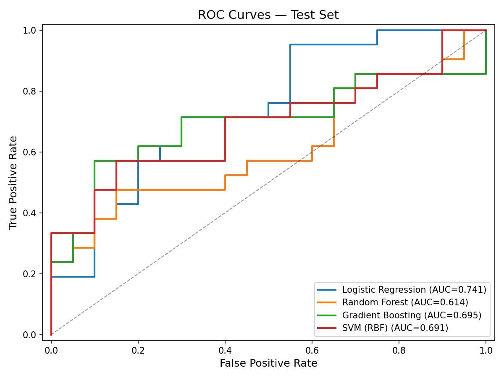
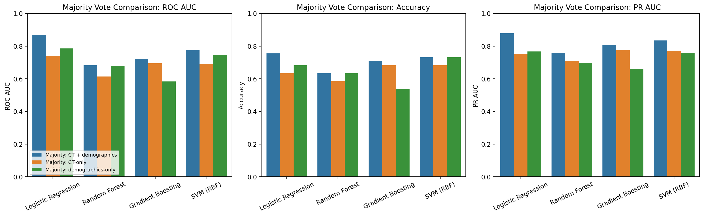

# Methods Document — THA Cement Decision ML Study

**Working title:** The Artificial Intelligence versus the Orthopaedic Surgeon in Decision-Making of Cemented or Uncemented Total Hip Arthroplasty

**Last updated:** 2026-03-03

---

## 1. Study Design

Retrospective cohort study using preoperative CT scans from patients who underwent total hip arthroplasty (THA) at Landspítali University Hospital. The study develops supervised machine learning models to classify optimal THA implant fixation (cemented vs. non-cemented) using exclusively CT-derived imaging features.

## 2. Data Sources

### 2.1 Cohorts

| Cohort | Scanner | Period | Patients | Notes |
|--------|---------|--------|----------|-------|
| Cohort_2 | Toshiba | 2023–2024 | ~50 | Newer acquisitions, generally high quality |
| Cohort_1 | Philips | ~2013 | ~100 | Older acquisitions, more variable quality |

Both cohorts followed similar preoperative CT protocols (bilateral hips, pelvis, and proximal femur acquired one day before THA). Cohort_1 data originates from prior studies conducted by the research team at the University of Reykjavík and Landspítali.

### 2.2 Variables

**CT-derived imaging features (model inputs):**
- Gruen zone BMD values: zones 1–7 (`zone_1_bmd` through `zone_7_bmd`)
- Cortical geometry: `cortical_area_mm2`, `cortical_thickness_mm`
- Radial measurements: `avg_outer_radius_mm`, `ray_inner_radius_mm`, `geometric_inner_R_mm`, `inner_radius_std_mm`

**Engineered features:**
- Zone average pairs: `zones_1_7_avg` (mean of zones 1 and 7), `zones_2_6_avg` (mean of zones 2 and 6)
- BMD-to-cortical ratios: zone averages divided by cortical thickness and cortical area
- BMD summary statistics: mean, standard deviation, and range across all 7 zones

**Demographic variables (recorded but excluded from modeling):**
- Age, sex, weight, height, BMI

**Surgeon classifications:**
- `Cement_vs_noCement_original`: original operating surgeon's decision
- `Halldor_decision`: independent classification by Dr. Halldór Jónsson Jr.
- `3d_surg`: classification by a third surgeon reviewer

### 2.3 Unit of Analysis

Each hip (left/right) constitutes one observation. Patients with bilateral scans contribute two observations, but all hips from the same patient are always kept in the same data split (train or test) to prevent data leakage.

## 3. Ground Truth Definition

Three ground truth strategies were defined to examine the impact of label uncertainty:

1. **Original surgeon only:** The operating surgeon's preoperative decision serves as the label.
2. **Majority vote:** A hip is labeled "cemented" if at least 2 of 3 surgeons classified it as cemented; otherwise "non-cemented."
3. **Vote fraction (probabilistic):** The fraction of surgeons voting "cemented" (0, 0.33, 0.67, or 1.0) provides a soft label for potential probabilistic training experiments.

The primary analysis uses the **majority vote** label.

### 3.1 Inter-Rater Agreement

Before defining the ground truth, inter-surgeon agreement was quantified:
- **Pairwise percent agreement** for all three rater pairs
- **Fleiss' kappa** for the three-rater panel (binary classification)
- **Case-level categorization:** unanimous (3/3 agree), majority only (2/3 agree)

Label harmonization: "Uncemented" was mapped to "Non-cemented." Rows with the label "Already operated" were excluded from agreement analysis and modeling.

## 4. Data Quality & Exclusion Criteria

### 4.1 Scan Quality Flags

Scans annotated in the `notes` column as "Unusable with same HU range" were excluded. Scans flagged as "Questionable Quality" or "Questionable scan quality" were retained but their presence noted for sensitivity analysis.

### 4.2 Anomalous Value Detection

Rows were excluded if they contained CT feature values outside physiologically plausible ranges:
- Zone BMD values < 0.5 (artifact values, e.g. 0.14)
- Cortical area < 50 mm² (values such as 0.47, 3.96, 4.54 indicating failed segmentation)
- Cortical thickness < 2.0 mm (values such as 0.74, 1.24 indicating failed segmentation)

## 5. Preprocessing Pipeline

All preprocessing was performed in a leakage-safe manner: imputation and scaling parameters were fitted exclusively on the training set.

### 5.1 Train/Test Split

- **Split ratio:** 80% train / 20% test
- **Grouping:** Patient-level (`Anonymize_ID`) — all hips from a patient stay in the same split
- **Stratification:** By ground truth label and cohort source to maintain class and cohort balance in both sets
- **When reusing the “same split” in later analyses:** this refers to the same patient/hip membership in train and test (not just another 80/20 split). Matching was verified at the row key level (`Anonymize_ID` + `hip_side`).

### 5.2 Missing Value Imputation

K-nearest neighbors (KNN) imputation with `k=5` and distance-weighted averaging was applied **separately by cohort**:
- Cohort_2 missing values were imputed using only other Cohort_2 training observations
- Cohort_1 missing values were imputed using only other Cohort_1 training observations

This prevents cross-cohort contamination given known distributional differences between scanner manufacturers (Toshiba vs. Philips).

Imputers were fitted on training data only; the same fitted imputers were applied to the corresponding cohort partitions in the test set.

### 5.3 Feature Engineering

After imputation, the following derived features were computed:
1. `zones_1_7_avg`: mean of zone 1 and zone 7 BMD
2. `zones_2_6_avg`: mean of zone 2 and zone 6 BMD
3. Ratios: each zone average divided by `cortical_thickness_mm` and `cortical_area_mm2`
4. Summary statistics: mean, standard deviation, and range of zones 1–7 BMD

### 5.4 Feature Scaling

StandardScaler (zero mean, unit variance) was fitted on the training set and applied to both train and test sets.

### 5.5 Total Feature Count

13 base CT features + 9 engineered features = **22 features** used as model inputs.

## 6. Machine Learning Models

Four classifiers were trained and compared:

| Model | Key Hyperparameters |
|-------|-------------------|
| Logistic Regression | solver=lbfgs, max_iter=2000 |
| Random Forest | n_estimators=200, min_samples_leaf=3 |
| Gradient Boosting | n_estimators=200, max_depth=3, learning_rate=0.1 |
| SVM (RBF kernel) | probability=True, default C and gamma |

Demographic variables (age, sex, weight, height, BMI) were **not** included as model features. `Anonymize_ID` was never used as a feature.

## 7. Model Evaluation

### 7.1 Cross-Validation

Grouped 5-fold cross-validation was used during training, with patient ID as the grouping variable, to obtain unbiased performance estimates and prevent leakage.

### 7.2 Test Set Metrics

The following metrics were computed on the held-out test set:
- ROC-AUC
- PR-AUC (precision-recall area under curve, important if class imbalance exists)
- Accuracy
- Precision
- Recall (sensitivity)
- F1 score
- Confusion matrix

### 7.3 Cohort-Specific Evaluation

All test metrics were also reported separately for Cohort_1 and Cohort_2 to assess the impact of cohort/scanner differences on model performance.

### 7.4 Feature Importance

For tree-based models (Random Forest, Gradient Boosting), feature importance scores were extracted to identify which CT-derived measurements contribute most to the classification.

## 8. Software & Reproducibility

- **Language:** Python 3.x
- **Key libraries:** pandas, numpy, scikit-learn, scipy, statsmodels, matplotlib, seaborn
- **Random seed:** 42 (used consistently across all stochastic operations)
- All pipeline steps are implemented as sequential scripts (`01_data_audit.py` through `04_train_evaluate.py`) that produce intermediate outputs to enable inspection at each stage.

## 9. Planned Sensitivity Analyses

- Model performance on **unanimous-only** ground truth subset (3/3 surgeon agreement)
- Model performance on **majority-vote** full set
- Cohort-specific models (train/test within a single cohort)
- Impact of including vs. excluding "Questionable Quality" scans
- Comparison with models that include demographic features (age, sex, BMI) to quantify the marginal value of CT-only classification

## 10. Ethical Considerations

- All patient data were de-identified prior to analysis (`Anonymize_ID` used as the only identifier)
- CT scans were acquired as part of standard preoperative protocols; participation did not influence surgeon decisions
- Approved by the Ethics Committee of Landspítali (reference 33_2033) and the Scientific Research Committee (VRN LSH 230530)
- All patients provided signed informed consent for use of their CT scans in prosthetic joint research

---

## Revision Log

| Date | Change |
|------|--------|
| 2026-03-03 | Initial methods document created. Pipeline steps 1–4 implemented. |
| 2026-03-05 | Pipeline steps b-d implemented. |

---

## Discussion (Draft Start)

This initial analysis supports the central premise of the project: CT-derived quantitative features can provide clinically meaningful signal for THA fixation decision support, but label uncertainty and cohort heterogeneity remain major determinants of model behavior.

Inter-rater agreement among surgeons was limited (Fleiss' kappa = 0.2367, interpreted as fair agreement), with only 44.3% of hips receiving unanimous labels and 55.7% assigned by majority-only agreement. This finding is important because it confirms that the prediction target is not fully stable across experts and that any model evaluation should be interpreted in the context of imperfect ground truth. In practical terms, this supports the use of sensitivity analyses across multiple label definitions (original-surgeon, majority-vote, and vote-fraction approaches).

After predefined quality filtering and anomaly exclusion, 200 hips from 111 patients remained for analysis. This cleaning step removed clearly implausible CT-derived values (e.g., BMD artifact values and failed segmentation geometry), reducing noise and likely improving model reliability. The resulting majority-vote ground truth was moderately balanced (115 non-cemented vs 85 cemented), allowing standard binary classification metrics to be informative without severe class-imbalance correction.

In model comparison, test-set performance suggested that no single algorithm is uniformly superior across all metrics. Logistic Regression produced the highest ROC-AUC (0.7405), indicating strong ranking performance and suggesting that a linear baseline remains competitive in this dataset. Gradient Boosting and SVM achieved the highest accuracy (0.6829 each), with Gradient Boosting also yielding the strongest PR-AUC (0.7736), which is relevant when positive-class enrichment varies across splits. Random Forest performed less favorably in this run. The combination of moderate discrimination and relatively modest absolute performance indicates useful signal, but not yet a deployment-ready classifier.

Feature-importance patterns in tree-based models were biologically plausible and aligned with prior hypotheses: internal radius measures (`ray_inner_radius_mm`, `geometric_inner_R_mm`), cortical-related ratios, and BMD variability features were recurrently influential. These results suggest that local geometric structure and CT-derived bone quality heterogeneity may be at least as informative as absolute zone values alone for fixation classification.

Cohort-specific evaluation indicated domain shift between Cohort_1 and Cohort_2, with model behavior differing substantially across scanners and acquisition eras. This is consistent with known differences in image quality and distribution between older Philips and newer Toshiba data. These differences reinforce the need for domain-aware validation, cohort-stratified reporting, and potentially harmonization or domain-adaptation strategies in later phases.

Overall, the current pipeline demonstrates a reproducible and leakage-safe framework for iterative modeling. The immediate next discussion-level priorities are: (1) quantifying robustness under alternative ground truth definitions, (2) repeating analyses on unanimous-only subsets, (3) explicitly testing the impact of retaining vs excluding questionable-quality scans, and (4) assessing generalization under stricter cohort transfer settings. Together, these steps will clarify whether observed model performance reflects stable biological signal or sensitivity to labeling and cohort artifacts.

### Comparative sensitivity analyses across four ML exercises

To quantify how label definition and feature family choices influence predictive performance, four separate analyses were executed with isolated scripts and output folders:

1. Majority-vote ground truth, CT-derived features only.
2. Vote-fraction ground truth (continuous target), CT-derived features.
3. Majority-vote ground truth, CT + demographic features (same train/test split as analysis 1).
4. Majority-vote ground truth, demographic features only (same train/test split as analysis 1).

For direct classification comparison under majority-vote ground truth, Logistic Regression provided a clear and interpretable benchmark across feature sets:
- CT-only: ROC-AUC 0.7405, accuracy 0.6341, PR-AUC 0.7539.
- CT + demographics: ROC-AUC 0.8690, accuracy 0.7561, PR-AUC 0.8780.
- Demographics-only: ROC-AUC 0.7857, accuracy 0.6829, PR-AUC 0.7673.

This pattern suggests that demographic variables add meaningful predictive information in this dataset, and that the combined CT + demographic feature set performs best on the held-out split. Demographics-only models retain moderate predictive signal, but underperform the combined model, indicating that CT-derived features still contribute complementary value.

The vote-fraction analysis used a non-binary target and was evaluated primarily with regression metrics. The best RMSE was achieved by Linear Regression (RMSE 0.3058; R2 0.1831), while thresholded binary readouts were lower than majority-vote optimized classification runs.

Comparative artifacts are stored in `results_comparison_all_experiments/` (summary tables and figures).

